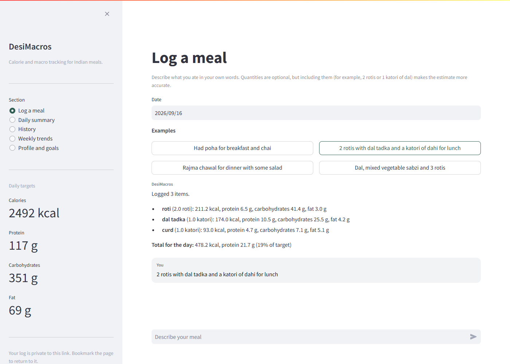
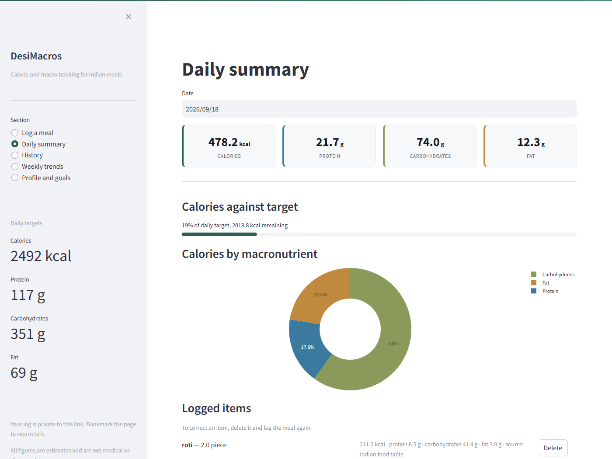
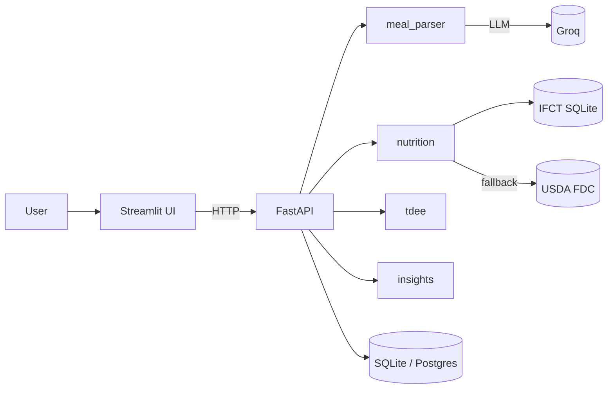

# 🥗 DesiMacros — Conversational Calorie Tracker

[](https://github.com/vidit-16/DesiMacros/actions/workflows/ci.yml)
[](LICENSE)
[](https://www.python.org/)

A calorie and macro tracker built for Indian diets. Log meals by describing them
in plain English — "2 rotis with dal tadka and a katori of dahi" — and it works
out the portions, macros and daily totals for you.

Built because every mainstream tracker expects you to weigh food in grams and
has no idea what a katori is.

**Live app:** https://desimacros.onrender.com/

<p align="center">
  
  
</p>
<p align="center"><em>A meal described in plain words, broken into items with calories and macronutrients (left). The day's totals and calories by macronutrient (right).</em></p>

## What it does

- **Talk to log.** An LLM turns a free-text meal description into structured
  items, splitting combined dishes ("rajma chawal" → rajma + rice) and handling
  desi units (katori, chapati, glass, handful).
- **Indian food first.** Nutrition comes from a curated IFCT table of common
  Indian dishes, then the USDA database. A food neither has gets a model
  estimate, labelled as an estimate, instead of being counted as 0 kcal.
- **Portion-aware.** "2 pieces" means something different for a roti (40g) than
  for a dosa (100g), and a katori of rice weighs less than a katori of dal. The
  lookup knows both.
- **Measured.** On 39 held-out meals scored against USDA reference values, the
  median meal is 15% off and 62% are within 20%
  ([how that was measured](docs/ACCURACY.md)).
- **Goals from your stats.** Mifflin-St Jeor BMR → TDEE → calorie and macro
  targets based on your activity level and whether you're cutting or bulking.
- **Insights.** Instant rule-based alerts on the day's macros, multi-day pattern
  detection, and an LLM-written weekly summary.
- **A log per visitor.** On a shared deployment each visitor gets their own
  entries and goals, keyed by a token the app keeps in the URL. Run it locally
  with no token and it behaves as a plain single-user app.

## Architecture



## Stack

- **Backend**: FastAPI + SQLAlchemy (SQLite locally, Postgres when deployed)
- **Frontend**: Streamlit
- **LLM**: Groq (`openai/gpt-oss-120b` by default, set `GROQ_MODEL` to change)
- **Nutrition**: curated IFCT subset in SQLite + USDA FoodData Central API
- **Container**: Docker

## Getting started

```bash
pip install -r requirements.txt
cp .env.example .env      # then add your keys
```

You need a free [Groq API key](https://console.groq.com/keys) for meal parsing.
The [USDA key](https://fdc.nal.usda.gov/api-key-signup) is optional — without it
you just lose the non-Indian food fallback.

Run the two processes in separate terminals:

```bash
uvicorn app.api.main:app --reload --port 8000
streamlit run app/ui/streamlit_app.py
```

The UI is at http://localhost:8501, the API docs at http://localhost:8000/docs.
Both SQLite databases are created and seeded on first run.

### Docker

```bash
docker compose up --build
```

Or run everything in one container (Streamlit public, API internal on 8000) —
this is what a single-service host like Render or Hugging Face Spaces wants:

```bash
docker build -t desimacros . && docker run -p 8501:8501 --env-file .env desimacros
```

## Deploying

The image runs both processes in one container, with Streamlit on the public
port and the API reachable only from inside it, so any single-service host works.

`render.yaml` describes the service for **Render**, so pointing a Blueprint at
this repository is enough to deploy it. Render prompts for `GROQ_API_KEY` and
the other secrets in its own dashboard; none of them live in the repo. The
container listens on whatever `$PORT` the host sets.

Hugging Face Spaces works too, but only its Docker SDK can run a process like
this, and that is a paid tier.

### Keeping history

Storage on free tiers is ephemeral, so SQLite files are cleared whenever the app
restarts. To keep logs, put them in a hosted Postgres:

1. Create a free database at [neon.tech](https://neon.tech) or
   [supabase.com](https://supabase.com) and copy its connection string.
2. Set `DATABASE_URL` to it in the host's dashboard and redeploy.

Paste the string as given — the `postgres://` form some providers hand out is
rewritten to the right driver automatically. The schema is created on first
boot, so there is no migration step.

To confirm the switch took, open the deployed app: the sidebar stops warning
that data is cleared on restart once storage is durable. `GET /health` also
reports `storage` as `sqlite` or `postgres`, but only where the API port is
reachable — running locally, or through docker-compose. A single-port host
exposes Streamlit alone, so that URL returns the UI there, not the API.

With `DATABASE_URL` left alone the app uses SQLite exactly as before, so local
development needs no database server.

## Configuration

| Variable | Purpose | Default |
| --- | --- | --- |
| `GROQ_API_KEY` | Meal parsing + weekly summary | *required* |
| `GROQ_MODEL` | Groq model ID (they get retired periodically) | `openai/gpt-oss-120b` |
| `USDA_API_KEY` | Fallback nutrition lookup | optional |
| `FOOD_ESTIMATES` | Model estimates for foods no database has; `off` logs them as 0 kcal | `on` |
| `DATABASE_URL` | Where meal logs live; SQLite or Postgres | `sqlite:///./data/desimacros.db` |
| `API_BASE_URL` | Where the UI finds the API | `http://localhost:8000` |
| `DEMO_MODE` | Warn visitors that data resets on restart | off |
| `TZ` | Timezone the day boundary follows | `Asia/Kolkata` |

## API

| Method | Route | Purpose |
| --- | --- | --- |
| `POST` | `/api/log` | Parse a meal description and log it |
| `GET` | `/api/summary` | One day's totals and entries |
| `GET` | `/api/history` | Entries grouped by date over a range |
| `DELETE` | `/api/entry/{id}` | Remove a mis-logged entry |
| `GET` | `/api/weekly` | Last 7 days of totals |
| `GET` | `/api/alerts` | Rule-based alerts for a day |
| `GET` | `/api/patterns` | Multi-day pattern detection |
| `GET` | `/api/weekly-summary` | LLM-written weekly feedback |
| `GET`/`POST` | `/api/profile` | Read/update stats and recalculate goals |
| `POST` | `/api/tdee-preview` | Calculate goals without saving |

## Project structure

```
DesiMacros/
├── app/
│   ├── api/main.py            # FastAPI routes + request validation
│   ├── core/config.py         # Settings from .env
│   ├── db/models.py           # SQLAlchemy models + migrations
│   ├── services/              # meal_parser, nutrition, food_estimator, tdee, insights
│   └── ui/streamlit_app.py    # Streamlit frontend
├── docs/                      # ACCURACY.md, DEVELOPING.md
├── evaluation/                # accuracy benchmark, USDA-labelled meals, model A/B
├── scripts/mutation_test.py   # lightweight mutation testing
├── tests/                     # pytest suite (Groq/USDA mocked)
├── Dockerfile, docker-compose.yml, render.yaml, start.sh
└── requirements.txt, requirements-dev.txt, ruff.toml, pytest.ini
```

## Tests

```bash
pip install -r requirements-dev.txt
pytest --cov=app                 # 216 tests, no API keys or network needed
ruff check app/api app/core app/db app/services tests scripts evaluation
python scripts/mutation_test.py  # mutation score for tdee, nutrition, food_estimator
python evaluation/benchmark.py --split test   # accuracy against USDA reference meals
```

The suite covers services, every API route, input validation (unusable stats
return 422 instead of a 500), smoke imports, and parity between
`/api/tdee-preview` and `calculate_goals` for every activity x goal combination.
Coverage: **87%** of `app/` (UI excluded).

**Mutation testing** (`scripts/mutation_test.py`, an AST mutator since mutmut
does not run on Windows): `tdee.py` 44/46 killed (95.7%), `nutrition.py` 42/81
(51.9%; survivors are mostly portion-weight constants), `food_estimator.py` 25/35
(71.4%), total **111/162 (68.5%)**.

**Accuracy benchmark** ([`docs/ACCURACY.md`](docs/ACCURACY.md)): 79 meal
descriptions labelled from USDA FNDDS, split into dev and held-out test halves.
On the test half, median calorie error fell from 50.0% to 14.6% and meals within
20% rose from 36% to 62%. No meal now contains a food counted as 0 kcal (before:
16 of 39).

**Model A/B** ([`evaluation/results.md`](evaluation/results.md)): on 10
labelled Indian meals, `openai/gpt-oss-120b` and `openai/gpt-oss-20b` both
parsed 100% of meals with the gold item count and 0% median calorie error
(~0.8s each). The Llama models are no longer served by Groq.

## Roadmap

- Lint and test the Streamlit UI module
- Grow the IFCT table and the A/B gold set
- Photo-based meal logging
- Alembic migrations for Postgres deployments

## Accuracy

[`docs/ACCURACY.md`](docs/ACCURACY.md) covers where every number comes from,
what has been measured (database coverage, parse stability), the errors that
remain, and what the app should not be used for. The summary: good for tracking
direction over weeks, not for precise calorie counting.

**This is not medical or dietary advice.** Calorie and macro targets are a
population-level estimate from the Mifflin-St Jeor equation, not a
recommendation for any individual.

[`docs/DEVELOPING.md`](docs/DEVELOPING.md) has the architecture, conventions and
the non-obvious traps, and is worth reading before changing the nutrition or
multi-user logic.

## License

MIT — see [LICENSE](LICENSE).

## Notes on the data

The IFCT table is a curated subset of ~46 common Indian dishes with approximate
per-100g values based on the NIN IFCT 2017 publication, plus portion weights for
counted foods. Anything outside it falls to USDA, and anything USDA cannot match
confidently is logged as zero and flagged rather than guessed at. Editing `IFCT_SEED_DATA` and restarting updates existing
databases in place, so corrections propagate without a migration.
